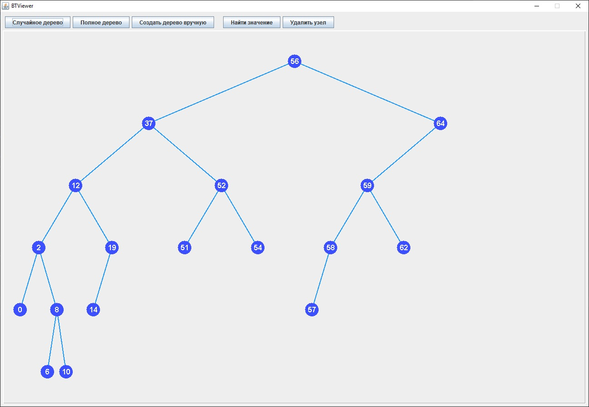
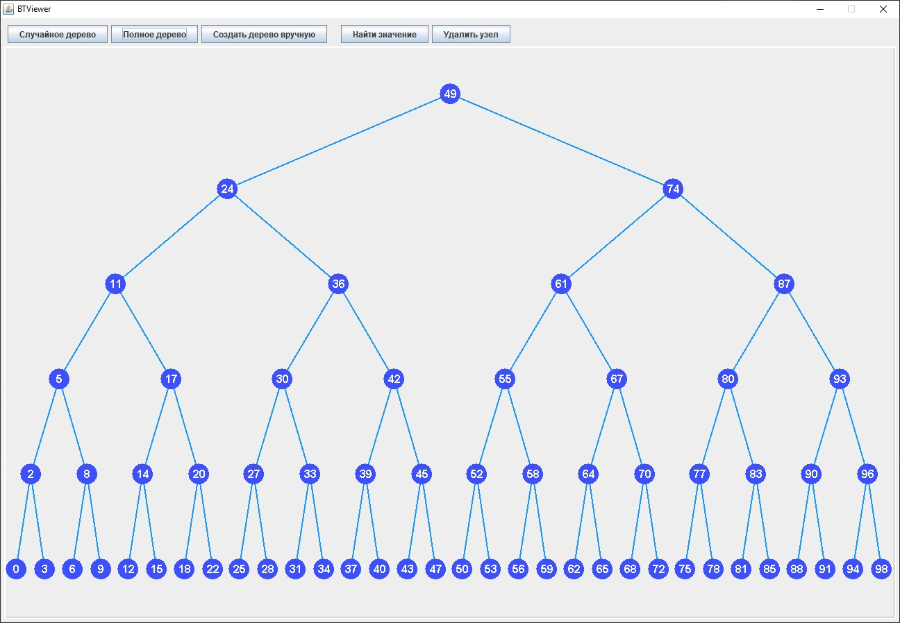
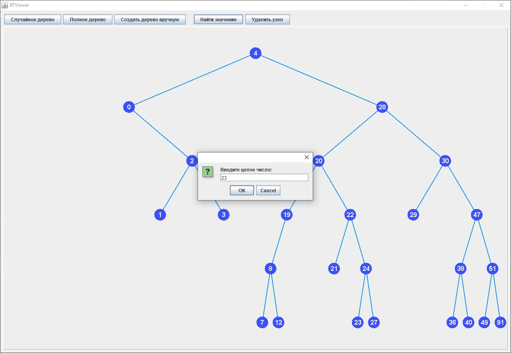
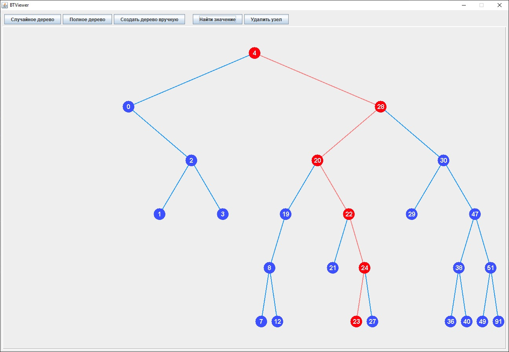
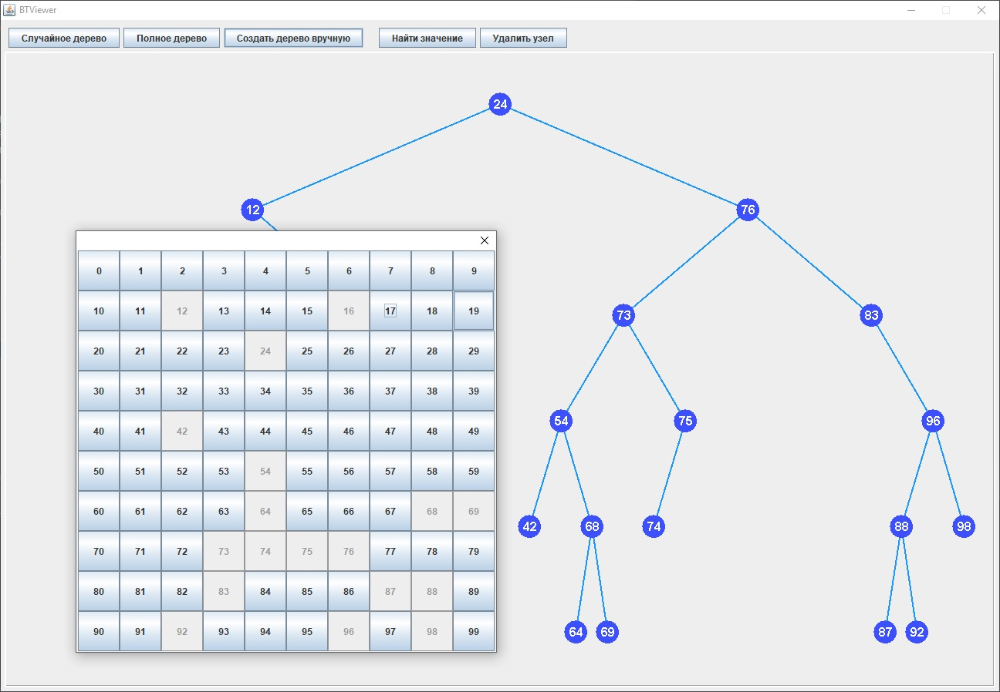

# BTViewer

Небольшой учебный проект по теме "Алгоритмы. Двоичные деревья". Программа позволяет создать и вывести на экран двоичное дерево. Можно создать дерево со случайным набором вершин, можно создать полное дерево, в котором каждая вершина имеет двух потомков, можно построить дерево вручную.
Реализованы также алгоритмы поиска пути к определенной вершине (если данной вершины нет, то выводится сообщение об этом) и удаления вершин с соответсвующим изменением конфигурации дерева (так, что оно всегда остается корректным).

Основные классы проекта: 
- MainClass. С него начинается выполнение.
- GUI. Создает главное окно и его элементы.
- BTPanel. Служит для отображения переданного ему дерева (экземпляр класса Tree)
- Tree. Необходим для хранения дерева и операций с ним: добавления, поиска и удаления элементов (каждая операция реализована в виде         отдельного метода).
- Node. Класс для хранения отдельных узлов дерева.
- TreeGenerator. Класс для генерации деревьев: со случайным набором вершин и полного дерева.
- TreeCreator. Классдля создания дерева в ручном режиме путем добавления в него отдельных значений.

Скриншоты проекта:

